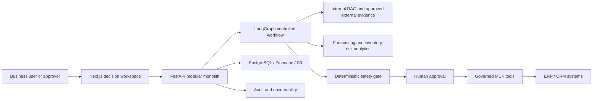

# Enterprise Decision Intelligence Platform (EDIP)

EDIP Version 2 is the approved architecture for a trustworthy enterprise decision-intelligence platform: grounded evidence, forecasting, governed agent workflows, deterministic controls, and accountable human decisions.

> **Current status:** Phase 0 repository audit and controlled cleanup are complete. The V2 architecture is approved. Phase 1 implementation has not started.

EDIP is not currently production-ready. Capabilities below are explicitly distinguished as current, approved target, or future work.

## Vision and positioning

Operational teams often have data and dashboards but still lack a defensible path from evidence to action. EDIP is intended to help inventory, supply-chain, operations, risk, and technology stakeholders determine:

- forecast inventory risk and its uncertainty;
- which internal and approved market evidence supports a recommendation;
- whether evidence is sufficient to decide or the system should abstain; and
- which actions require human approval and what was ultimately executed.

The flagship engineering goal is a reviewable enterprise platform rather than an unconstrained chatbot. Its research direction is: **Trustworthy Human-in-the-Loop multi-agent systems for safe, explainable, and auditable decision-making.**

## Status and evidence boundary

| State | Meaning |
|---|---|
| **Current implemented state** | A FastAPI application, Next.js UI, forecasting and replenishment code, agent/RAG experiments, tests, deployment assets, and monitoring assets exist. Phase 0 verified repository truth and completed controlled cleanup; it did not certify the whole system for production. |
| **Approved target architecture** | A capability-oriented modular monolith, LangGraph workflows, governed retrieval and integrations, deterministic safety controls, durable audit, and AWS ECS Fargate deployment define V2. |
| **Future implementation** | Phase 1 and later phases must implement, integrate, evaluate, secure, and validate the approved architecture through explicit acceptance gates. |

There is no claim here of complete test-suite health or live Pinecone, OpenAI, Kafka, AWS, or ERP/CRM operation.

## Approved V2 capabilities

- **Next.js frontend** for decision workspaces, evidence review, uncertainty display, approvals, and audit views.
- **FastAPI capability-oriented modular monolith** with explicit module boundaries; microservices are not the initial design.
- **LangGraph workflows** for durable, stateful, controlled orchestration.
- **Internal RAG with Pinecone** for tenant-scoped retrieval from governed enterprise knowledge.
- **Forecasting and inventory-risk analytics** with versioned data, models, metrics, and uncertainty evidence.
- **Approved external evidence** through a governed source registry, provenance, freshness, and citation controls.
- **Internal-to-market benchmarking** that keeps internal facts distinct from external evidence.
- **Deterministic safety gate** for critical calculations, policy checks, evidence sufficiency, and abstention.
- **Human-in-the-Loop (HITL) approval** before controlled, consequential execution.
- **Governed MCP integrations** for bounded ERP/CRM tools; LLMs must not authorize irreversible actions.
- **Durable audit and observability** using PostgreSQL business records, LangSmith traces, Prometheus/Grafana, and CloudWatch with distinct ownership.
- **AWS ECS Fargate deployment direction** as the canonical production target.

Kafka and Airflow are not mandatory V2 core components. They remain gated future options only if measured scale, scheduling, or event-processing needs justify their operational cost. Kubernetes is optional learning evidence, not the canonical deployment target.

## Architecture principles

- Trustworthy decisions require traceable evidence, uncertainty, abstention, and human accountability.
- Critical calculations and safety policies remain deterministic and testable.
- LLM output is advisory; it cannot directly authorize irreversible business actions.
- Tenant identity, RBAC, source approval, and audit context cross every capability boundary.
- The initial architecture is a capability-oriented modular monolith, not microservices.
- Python remains in the existing `app/` layout; no migration to a `src/` layout is planned.
- Online RAG and workflows will move to `app/rag/` and `app/workflows/` as contracts stabilize.
- Offline ingestion and model training remain under `pipelines/`.
- Forecasting migrates only after its artifacts, interfaces, and tests are stable.
- Generated datasets and artifacts stay outside Git, with manifests, versions, provenance, and checksums.
- LangSmith supports workflow observability but is not the authoritative business audit store.
- ECS Fargate is canonical; added infrastructure requires evidence-backed decisions.

## Architecture at a glance



See the [EDIP V2 Flagship Architecture Plan](docs/architecture/EDIP_V2_FLAGSHIP_ARCHITECTURE_PLAN.md) for complete boundaries, decisions, diagrams, gates, risks, and acceptance criteria.

## Phased V2 roadmap

1. **Phase 0 — completed:** establish repository truth, audit the baseline, and complete controlled cleanup.
2. **Phase 1 — Stable local baseline (next, not implemented):**
   - one supported Python runtime;
   - dependency reconciliation;
   - clean application and LangGraph imports;
   - full pytest collection;
   - controlled PostgreSQL initialization;
   - deterministic fixtures; and
   - API container startup and health/readiness smoke checks.
3. **Evidence and RAG:** implement governed ingestion, Pinecone retrieval, citations, evidence sufficiency, and retrieval evaluation.
4. **Analytics:** stabilize forecasting artifacts and tests, then add uncertainty-aware inventory-risk capability.
5. **Workflow and safety:** implement LangGraph state, controlled stages, deterministic gates, and abstention.
6. **Approval and execution:** add durable HITL decisions and bounded MCP execution with idempotency and audit.
7. **Evaluation and operations:** validate retrieval, forecasts, workflows, decisions, safety, reliability, security, and ECS Fargate delivery.

Each phase requires documented evidence and review before the next stable checkpoint is merged.

## Engineering framework alignment

EDIP adopts the [Enterprise AI/ML Engineering Framework](https://github.com/chathuranga-sudusinghe/enterprise-ai-ml-engineering-framework) as an evidence lifecycle:

**Problem → Data → Baseline → Advanced AI → Evaluation → Delivery → Production → Maintenance**

The architecture plan maps each stage to EDIP gates, required artifacts, validation evidence, owners, and review outcomes. Advanced AI follows adequate problem, data, and baseline evidence; deployment assets alone do not establish production readiness.

## Professional and research alignment

- **BCS CITP evidence:** responsibility and autonomy, architecture judgement, alternatives and trade-offs, stakeholder influence, security and ethical decisions, measurable outcomes, review, and professional reflection. No SFIA level is claimed.
- **MSc evidence:** applied architecture, reproducible evaluation, forecasting, RAG, deployment, observability, and critical analysis.
- **PhD direction:** trustworthy HITL multi-agent systems, reliable RAG, uncertainty-aware decisions, evidence sufficiency, abstention, safe execution, and auditable outcomes.

The traceability chain is: **finding → risk → decision → implementation → validation → outcome → reflection**.

## Repository structure

```text
app/          FastAPI application and current online capabilities
ui/           Next.js frontend
pipelines/    Offline ingestion, training, and evaluation workflows
tests/        Automated test assets
docs/         Architecture, audits, runbooks, and evidence
monitoring/   Prometheus and Grafana assets
infra/        Deployment and infrastructure assets
```

Some directories reflect the pre-V2 implementation. Their presence is evidence of repository assets, not proof that every component is integrated or operational.

## Local setup and usage

### Backend

Use Python 3.12, the supported EDIP runtime for local development, CI, and Docker.

```bash
python -m venv .venv
```

Activate the environment, then install and start the API:

```bash
python -m pip install -r requirements.txt
uvicorn app.main:app --reload
```

Open `http://localhost:8000/docs` for generated API documentation. External-provider features require valid configuration and credentials; installation alone does not demonstrate live connectivity.

### Frontend

```bash
cd ui
npm install
npm run dev
```

Open `http://localhost:3000`. The current frontend is an existing baseline and does not yet represent the complete approved V2 decision workspace.

### Tests and checks

```bash
pytest
cd ui
npm run lint
npm run build
```

These are contributor commands, not a claim that the entire suite currently passes in every environment. Consult the audit evidence and run relevant checks for each change.

## Current known limitations

- The Phase 1 stable local baseline is not yet established: runtime and dependencies require reconciliation; application and LangGraph imports, full pytest collection, controlled PostgreSQL initialization, deterministic fixtures, and API container health/readiness smoke checks remain to be validated.
- Pinecone-backed internal RAG and its ingestion, retrieval, isolation, freshness, and citation evaluations are not confirmed live.
- LangGraph orchestration, evidence-sufficiency rules, abstention, durable HITL resume, and deterministic execution gates require implementation and validation.
- Forecasting and inventory-risk artifacts require stabilization, versioning, provenance, uncertainty evaluation, and monitored acceptance thresholds before migration.
- External evidence needs an approved source registry and provenance, freshness, licensing, and injection-resistance controls.
- MCP ERP/CRM actions require allow-listed tools, least privilege, schema validation, idempotency, approval binding, and reconciliation testing.
- ECS Fargate is the approved deployment direction; a production AWS environment has not been demonstrated by this README.
- Existing tests, CI, monitoring, Kubernetes, and Terraform assets vary in maturity and do not demonstrate integrated production operation. Kafka and Airflow remain gated future options; the legacy demo assets are not part of the active runtime.

## Authoritative documents

- [EDIP V2 Flagship Architecture Plan](docs/architecture/EDIP_V2_FLAGSHIP_ARCHITECTURE_PLAN.md)
- [Phase 0 Completion Review](docs/audits/PHASE_0_COMPLETION_REVIEW.md)
- [All repository audits](docs/audits/)

## Contribution workflow

V2 work integrates through `dev`, using short-lived branches from `dev`. Reviewed phase checkpoints move from `dev` to `main`; `main` represents reviewed stable checkpoints. Architecture-significant decisions require an ADR, validation evidence, and stakeholder review.

## Responsible AI use

AI-assisted development may support drafting, review, tests, and documentation. Contributors remain responsible for technical correctness, security, evidence quality, licensing, and professional judgement.

## License

EDIP is publicly available for portfolio, professional evaluation, educational review, and research-demonstration purposes. It is not distributed under an open-source license. Copyright © 2026 Chathuranga Sudusinghe. All rights reserved. See [LICENSE](LICENSE) for permitted and prohibited uses.

## Project statement

EDIP V2 is an approved architecture and a phased engineering/research programme. It is not a claim of production readiness, complete integration, or completed Phase 1 delivery.