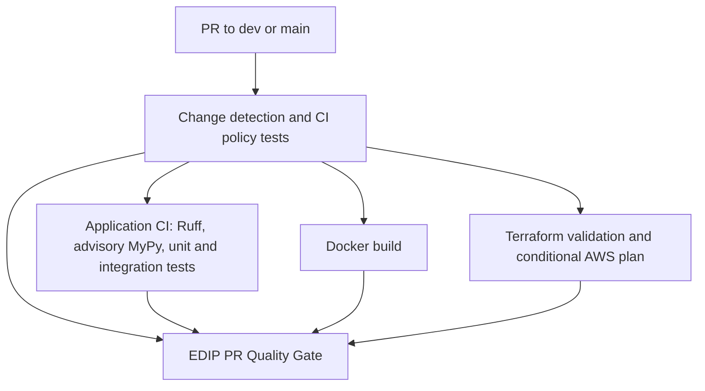

# EDIP pull-request CI orchestration

`pr-gate.yml` is the only PR-triggered CI workflow. It targets `dev` and `main` and calls the three focused specialist workflows through `workflow_call`. The stable required check is **EDIP PR Quality Gate**.

## Files changed

- `.github/workflows/pr-gate.yml`: PR trigger, concurrency, change detection, reusable workflow calls, and final required gate.
- `.github/workflows/integration-ci.yml`: reusable Python CI, unchanged manifest install and blocking lint/tests, advisory MyPy with visible failure reporting.
- `.github/workflows/docker-ci.yml`: reusable Docker validation; existing build command preserved.
- `.github/workflows/terraform-ci.yml`: reusable validation/plan workflow; cloud plan restricted to enabled, same-repository PRs.
- `.github/scripts/pr_gate.py`: conservative path classification and fail-closed result aggregation.
- `.github/scripts/test_pr_gate.py`: standard-library tests for path scenarios, result combinations, missing outputs, and rename handling.
- `docs/PR_CI.md`: architecture, transition decision, validation, and handoff.

`terraform-apply.yml`, infrastructure, application/model source, notebooks, and Python dependencies were not changed.

## Dependency graph



The three calls depend on `changes` and can run in parallel when selected. The final job explicitly needs `changes`, `application`, `docker`, and `terraform`, and uses `always()` so filtered or failed dependencies do not silently skip aggregation.

Within Terraform CI, AWS plan still depends on AWS static validation. Local Kubernetes, bootstrap, and AWS static validation remain separate jobs. Failure in any selected specialist blocks the final gate. The existing post-merge workflow remains separate: plan → saved artifact → protected apply.

## Path behavior

| PR changes | Application | Docker | Terraform | Final gate |
| --- | --- | --- | --- | --- |
| Application only | Run | Run | Skip | Requires selected checks to succeed |
| Infrastructure only | Skip | Skip | Run | Requires Terraform to succeed |
| Application + infrastructure | Run | Run | Run | Requires all three to succeed |
| Documentation only | Skip | Skip | Skip | Runs and passes after successful detection/policy tests |
| Orchestration or routing-policy files | Run | Run | Run | Requires all three to succeed |

Exact policy:

- Infrastructure: `infra/**`, `.github/workflows/terraform-ci.yml`, and `.github/workflows/terraform-apply.yml` select Terraform, without selecting Python or Docker on their own.
- Routing controls: `.github/workflows/pr-gate.yml`, `.github/scripts/pr_gate.py`, and `.github/scripts/test_pr_gate.py` select all specialists because these files also control Terraform execution.
- Documentation skips: `docs/**`, root `README.md`, `LICENSE`, and `LICENSE.md`. Infrastructure documentation under `infra/**` retains infrastructure validation.
- Everything else conservatively selects Application CI and Docker. This covers Python source/tests, `pyproject.toml`, Docker inputs, specialist application/Docker workflow files, and future unknown paths. It may run Docker unnecessarily for test-only or frontend-only changes; that is deliberate until narrower ownership is defined.
- Mixed paths combine their required checks.

Detection uses a full checkout and `git diff base...head` against event SHAs. NUL-separated filenames handle whitespace safely. `--no-renames` includes both the removed and added paths, so moving infrastructure into docs cannot bypass validation. Detection is local rather than using a potentially truncated file-list API. There are no workflow-level PR path filters that could prevent the stable final check from appearing.

The gate allows `skipped` only for an unselected specialist. Failure, cancellation, missing/invalid routing outputs, unexpected required-job skips, or failed detection prevent a successful gate. A superseded run can be cancelled by PR concurrency; it cannot supply a successful gate for the new commit. An intentionally disabled AWS plan does not invalidate successful static validation.

## MyPy transition

MyPy runs as `mypy`, using the existing `pyproject.toml` scope (`app` and `pipelines`). Its step alone uses `continue-on-error: true`. A failed outcome emits a warning and a job-summary explanation, while the complete diagnostics remain in the step log. Ruff, dependency installation, unit tests, and integration tests remain blocking.

The known baseline is 61 MyPy errors; making it required now would block otherwise valid PRs. This advisory period also allows new type errors, so it is temporary, not a regression guarantee. In separately scoped work, fix the baseline and required stubs without blanket suppression, demonstrate a clean run, then remove `continue-on-error` and the advisory wording. A count-based error budget is intentionally avoided because unchanged counts can hide new errors. The 28 existing formatter findings remain outside this task; no formatting gate is added.

## AWS and deployment boundaries

Terraform static jobs require no cloud role. Cloud planning retains `AWS_TERRAFORM_AUTOMATION_ENABLED == 'true'` and additionally requires a same-repository PR. Fork PRs run static validation only. The caller supplies the GitHub `id-token: write` permission required by the existing plan job; no AWS role, permission policy, OIDC trust, bucket, backend, or Terraform resource is changed. No secrets are inherited wholesale by reusable calls.

When cloud planning is enabled, existing AWS S3 IAM refresh failures can still fail an infrastructure PR. They are neither suppressed nor repaired here. Passing static checks on a disabled/fork plan is not evidence of a successful AWS plan.

There is no application deployment, image publishing, `workflow_run`, `pull_request_target`, or duplicate push CI trigger. The sole remaining `push` trigger is the unchanged production Terraform apply workflow on `main` with its existing paths and environment protection.

## Before and after

Previously, Python and Docker workflows independently ran on every PR to `dev`/`main`, including docs-only and infra-only PRs. Terraform had its own narrow PR path trigger. There were no duplicate push-triggered PR checks to remove, but no single check aggregated specialist outcomes.

Now one PR workflow routes focused reusable workflows and reports a stable aggregate check. Specialists have no independent PR/push triggers, so calling them does not duplicate their execution. Older in-progress runs from the previous configuration may still appear during rollout.

## Validation

- All five workflow YAML files parsed successfully; checked with YAML BaseLoader to preserve the `on` key.
- Official actionlint v1.7.12: passed for all workflows; downloaded to `/tmp` and verified against its published SHA-256.
- Eight policy unit tests passed, including the four requested scenarios, 192 result combinations, failure/cancellation/missing-output handling, infrastructure/workflow routing, and rename/NUL parsing.
- Verified branch targets `dev`/`main`, one PR trigger, reusable-only specialist triggers, no duplicate CI push or `workflow_run`, conditional specialist calls, and acyclic `needs` graphs.
- Verified only MyPy is advisory in Application CI; the manifest install and existing test commands remain intact.
- `ruff check .`: passed. Formatting checked only for the new CI helpers; no existing formatter/type-check debt was modified.
- `git diff --check`: passed.
- `terraform-apply.yml` compared byte-for-byte with `HEAD`: unchanged. No diff in infrastructure, notebooks, or application/model source.

These are local policy and syntax checks. No GitHub-hosted PR workflow, AWS plan, or production apply was executed. First-run reusable-workflow status propagation and the repository's live branch-protection configuration still need verification in GitHub.

## Rollout and handoff

Current branch: `chore/cicd-orchestration-foundation`. No commit, push, merge, branch change, or branch-protection mutation was performed.

After the workflow has reported on a real PR, configure **EDIP PR Quality Gate** as the required status check for `dev` and `main`. Replace obsolete directly required specialist checks, since those can legitimately be skipped or gain reusable-workflow name prefixes. Keep human review requirements. Do not require the advisory MyPy step separately. Confirm the four routing scenarios on GitHub during rollout.

If merge queues are later enabled, add and validate a dedicated `merge_group` path strategy before using this PR-only gate with a queue. This task targets ordinary pull requests only.

Suggested commit: `chore(ci): add PR quality gate orchestration`.

Suggested commands after reviewing the diff (not executed):

```bash
git add -- .github/workflows/pr-gate.yml .github/workflows/integration-ci.yml .github/workflows/docker-ci.yml .github/workflows/terraform-ci.yml .github/scripts/pr_gate.py .github/scripts/test_pr_gate.py docs/PR_CI.md
git commit -m "chore(ci): add PR quality gate orchestration"
```

Next terminal command: `git diff -- .github/workflows`. Next engineering step: review the new orchestration/helper files and this report, then authorize the Git steps and live PR rollout. No PR was created.

References: [GitHub reusable workflows](https://docs.github.com/en/actions/how-tos/reuse-automations/reuse-workflows), [actionlint releases](https://github.com/rhysd/actionlint/releases/tag/v1.7.12).
