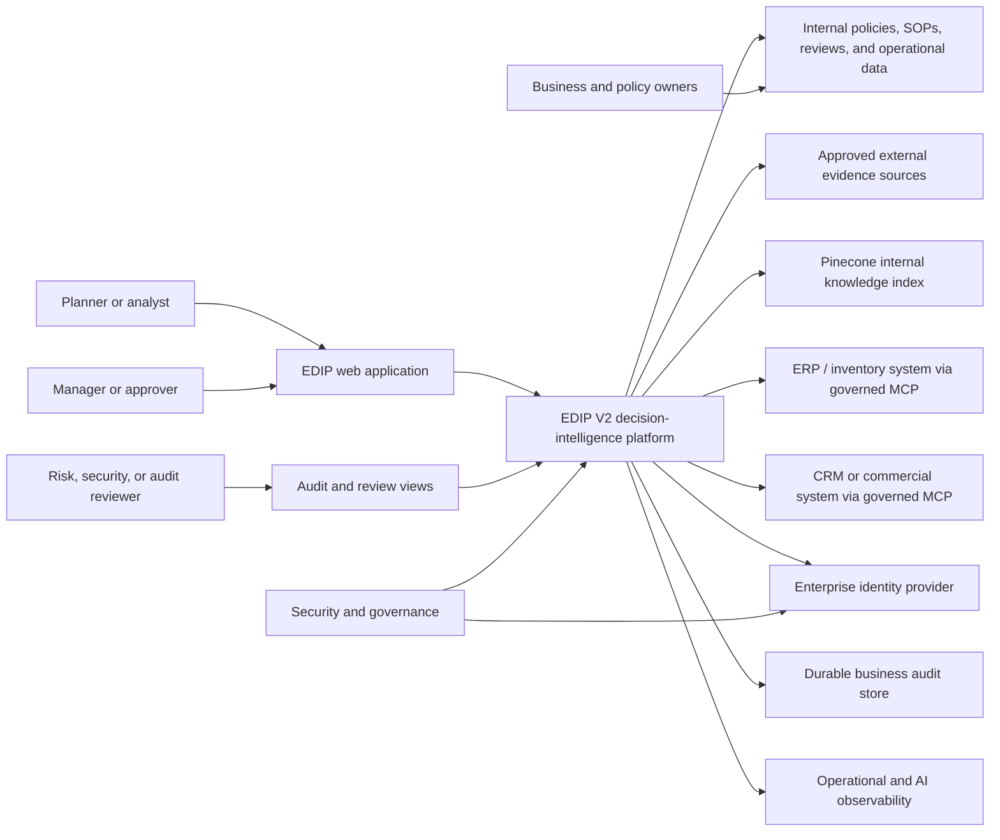
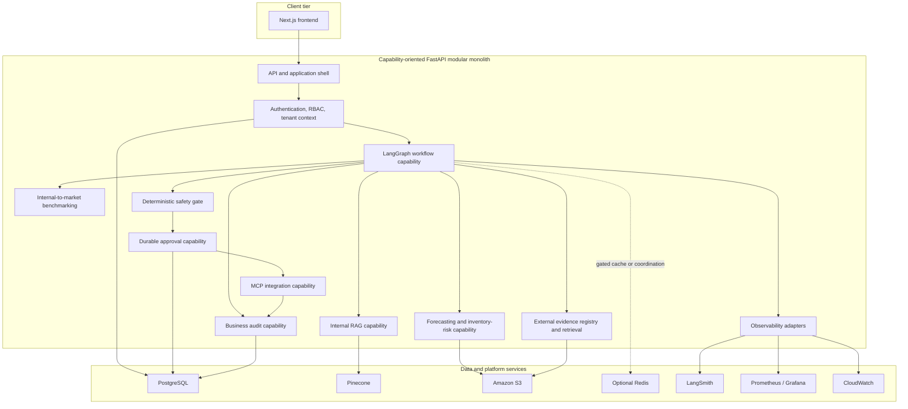
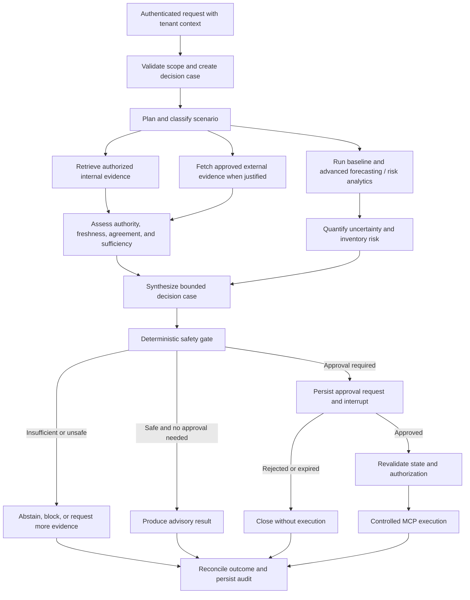
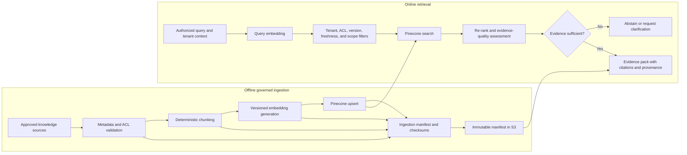
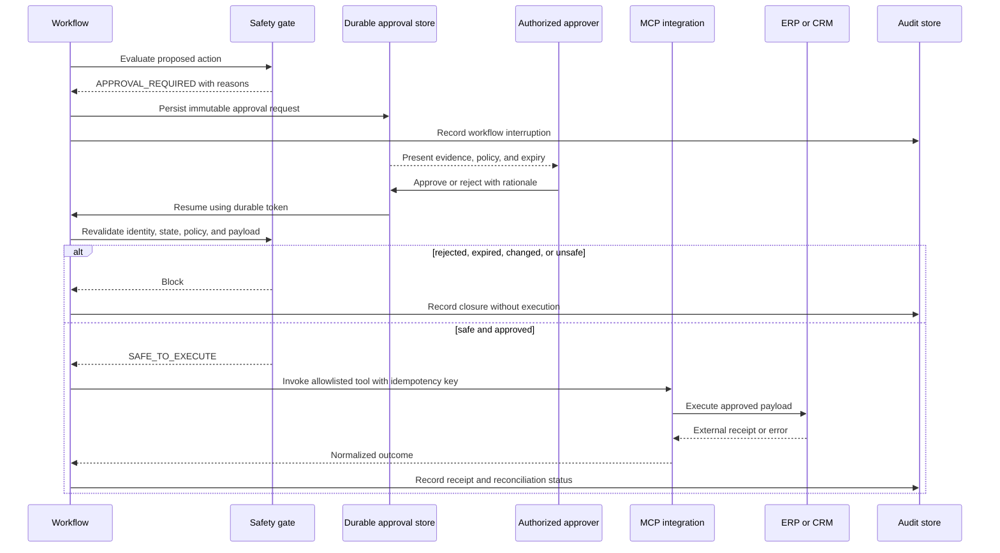
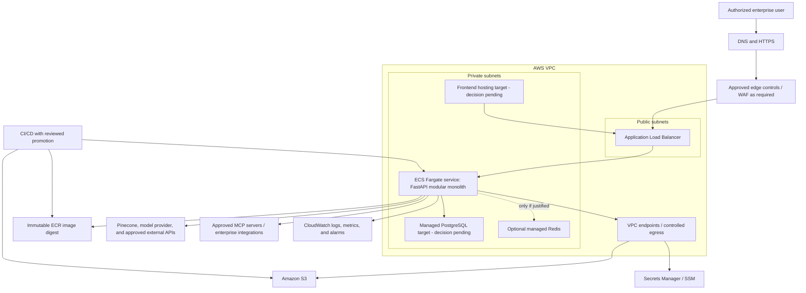
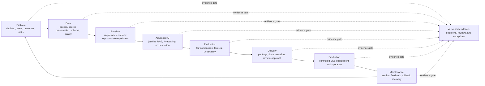

# EDIP Version 2 Flagship Architecture Plan

| Field | Value |
|---|---|
| Document status | Authoritative architecture plan |
| Document version | 1.0 |
| Approval status | Proposed — pending architecture review and merge |
| Architecture baseline date | 30 July 2026 |
| Repository | `enterprise-decision-intelligence-platform-edip` |
| Governing branch at creation | `docs/edip-v2-flagship-architecture` |
| Intended target | EDIP Version 2 |
| Current maturity represented | Integrated engineering demonstrator under controlled improvement |
| Production-readiness claim | None |
| SFIA claim | None |

> Based on the Enterprise AI/ML Engineering Framework by Chathuranga Sudusinghe, used under CC BY 4.0. This document adapts the framework lifecycle and evidence-gate approach for EDIP and identifies the adaptation explicitly.

## 1. Document authority and purpose

This document is the authoritative architecture and delivery plan for EDIP Version 2. It establishes the target system boundaries, confirmed architecture decisions, gated proposals, implementation sequence, evidence requirements, decision controls, review obligations, and success criteria.

It supersedes earlier roadmap proposals where they conflict with this plan. It does not rewrite historical audit findings or convert recommendations into implementation evidence. The audit records remain authoritative for the repository state they observed; the final Phase 0 completion review and verified current repository structure determine the current baseline.

This plan is an architecture authority, not an implementation record. A component shown in a target diagram is not implemented merely because it appears here. Each capability must pass its phase acceptance criteria and be linked to code, tests, artifacts, operational evidence, stakeholder review, and reflection as applicable.

### 1.1 Evidence precedence

When sources differ, apply this precedence:

1. Verified current repository code, configuration, tracked structure, and test results.
2. The final Phase 0 completion review.
3. Later focused implementation audits.
4. The repository-structure and initial-system baseline audits, interpreted as historical evidence.
5. This target plan and approved ADRs for future work.
6. General documentation and unverified claims.

### 1.2 Status vocabulary

| Status | Meaning |
|---|---|
| **CONFIRMED DECISION** | Approved direction that implementations must preserve unless superseded by an approved ADR. |
| **CONFIRMED CURRENT STATE** | Verified in the current repository or final Phase 0 evidence. |
| **TARGET PROPOSAL** | Intended V2 design that still requires implementation and validation. |
| **GATED OPTION** | May be adopted only after a named decision and evidence gate. |
| **OUT OF SCOPE** | Explicit non-goal for V2 or for the current phase. |

### 1.3 Source evidence

This plan uses every Markdown file under `docs/audits/`:

- `EDIP_INITIAL_SYSTEM_BASELINE_AUDIT.md`
- `EDIP_REPOSITORY_STRUCTURE_AUDIT.md`
- `EDIP_CI_BASELINE_AUDIT.md`
- `PHASE_0_BATCH_0B_STALE_PATH_CLEANUP_AUDIT.md`
- `PHASE_0_BATCH_0C_MONITORING_OWNERSHIP_AUDIT.md`
- `PHASE_0_BATCH_0D_RAG_CONFIGURATION_CONTRACT_AUDIT.md`
- `PHASE_0_BATCH_0E_UNUSED_CODE_ENDPOINTS_AUDIT.md`
- `PHASE_0_COMPLETION_REVIEW.md`

It also uses the verified current tracked structure and these framework sources:

- [Enterprise AI/ML Engineering Framework v2.1.0](https://github.com/chathuranga-sudusinghe/enterprise-ai-ml-engineering-framework)
- [Framework overview](https://github.com/chathuranga-sudusinghe/enterprise-ai-ml-engineering-framework/blob/main/framework/01_framework_overview.md)
- [Twenty main steps](https://github.com/chathuranga-sudusinghe/enterprise-ai-ml-engineering-framework/blob/main/framework/03_20_main_steps.md)
- [Thirty engineering rules](https://github.com/chathuranga-sudusinghe/enterprise-ai-ml-engineering-framework/blob/main/framework/04_30_engineering_rules.md)

## 2. EDIP V2 vision

EDIP V2 will be a trustworthy enterprise decision-intelligence platform for inventory and demand-planning decisions. It will combine approved internal knowledge, external evidence, forecasting, inventory-risk analytics, deterministic policy controls, bounded LangGraph orchestration, human approval, and controlled ERP/CRM actions.

The system will help an authorized decision-maker answer:

- What is happening?
- What internal and external evidence supports that assessment?
- What is forecast to happen, with what uncertainty?
- What inventory or service risk follows?
- What action is recommended, and which deterministic rules apply?
- Is the evidence sufficient to act, or must the system abstain?
- Who must approve the action?
- What exactly was executed, by whom, against which system, and with what result?

EDIP V2 will optimize for decision quality, safety, traceability, and recoverability rather than agent autonomy. The platform will make uncertainty and missing evidence visible. It will not present generated text as authority and will not allow an LLM to authorize an irreversible business action.

## 3. Business problem and target stakeholders

### 3.1 Business problem

Enterprise inventory decisions are often delayed or weakened by fragmented policy documents, disconnected operational data, inconsistent forecasts, unstructured market evidence, unclear approval rules, and incomplete audit trails. Planners must reconcile stock position, demand, supplier performance, service-level targets, promotions, market signals, and governance constraints under time pressure.

EDIP V2 addresses this problem by producing an evidence-linked decision case with:

- scoped operational facts;
- time-valid internal policy evidence;
- approved external evidence;
- baseline and advanced forecasts;
- uncertainty and inventory-risk measures;
- deterministic safety and authorization results;
- explicit abstention or approval states;
- controlled execution instructions; and
- durable audit and outcome records.

### 3.2 Target stakeholders

| Stakeholder | Primary need | Decision authority or concern |
|---|---|---|
| Demand and inventory planners | Explainable forecasts, risk, recommendations, and evidence | Prepare and review operational decisions |
| Supply-chain and regional managers | Exceptions, trade-offs, exposure, and approval queues | Approve higher-impact decisions |
| Commercial and promotion teams | Demand signals and promotion effects | Provide context and challenge assumptions |
| Procurement and supplier managers | Supplier risk and replenishment implications | Review supply-side actions |
| Executive sponsors | Outcome measures, material risks, and control effectiveness | Approve scope, policy, and high-impact exceptions |
| Data and ML engineers | Reproducible data, models, evaluation, and provenance | Own analytical evidence |
| Software and platform engineers | Reliable interfaces, deployment, recovery, and cost | Own system operation |
| Security, privacy, and governance reviewers | Identity, access, data handling, tool boundaries, audit integrity | Approve controlled use |
| Internal audit and risk | Decision trace and policy enforcement evidence | Independent assurance |
| Researchers and academic reviewers | Reproducible hypotheses and reliability evidence | Evaluate research contribution |

## 4. Flagship and research positioning

EDIP V2 is a **flagship engineering and research project**. That classification requires broader evidence and review than a demonstration or mini project. It does not imply production readiness.

The flagship contribution is the integrated, trustworthy decision path:

```text
authorized request
→ internal and approved external evidence
→ forecast and inventory-risk analysis
→ uncertainty and evidence-sufficiency assessment
→ deterministic safety decision
→ human approval when required
→ controlled ERP/CRM action
→ durable outcome and audit evidence
```

The research contribution is the evaluation of adaptive, trustworthy, and reliable multi-stage or multi-agent systems, with particular emphasis on:

- reliable RAG;
- evidence authority, agreement, freshness, and sufficiency;
- uncertainty-aware decisions;
- abstention;
- bounded agent roles;
- deterministic safety controls;
- Human-in-the-Loop effectiveness; and
- complete-system reliability under failure.

Claims such as “adaptive,” “reliable,” “trustworthy,” or “multi-agent” require defined measures and comparative evidence. They are research objectives, not assumed properties.

## 5. Scope and explicit non-goals

### 5.1 In scope

- Authenticated internal planning users.
- Tenant-aware and role-aware access.
- Internal RAG using Pinecone.
- Approved external evidence and market benchmarking.
- Forecasting and inventory-risk analytics.
- LangGraph orchestration of bounded stages.
- Deterministic safety, policy, and authorization gates.
- Durable human approval and resume.
- Controlled MCP-mediated ERP/CRM actions.
- PostgreSQL decision, approval, configuration-reference, and audit data.
- S3 datasets, models, reports, manifests, and immutable artifacts.
- Prometheus/Grafana, CloudWatch, LangSmith, and a durable business audit store with distinct ownership.
- Canonical AWS ECS Fargate deployment.
- Framework-governed evaluation and release gates.
- CITP and MSc/PhD evidence capture.

### 5.2 Explicit non-goals

- **No initial microservices decomposition.**
- **No Python `src/` layout migration.**
- No direct LLM authorization of irreversible business actions.
- No autonomous unrestricted ERP, CRM, purchasing, pricing, transfer, or inventory actions.
- No claim that LangGraph stages are independent autonomous agents unless implementation and evaluation later justify that term.
- No claim of production readiness until every production gate passes.
- No claim of an SFIA level.
- No requirement to deploy Kubernetes in the canonical production path.
- No real-time streaming requirement unless a measured business need and ADR justify it.
- No broad forecasting package migration before artifact contracts and tests are stable.
- No tracking of generated datasets or binary artifacts in Git.
- No use of LangSmith as the authoritative business audit store.
- No ingestion of arbitrary public-web content into decision workflows.
- No creation of empty future capability packages before their first real implementation.

## 6. Architecture principles

1. **Problem and decision first.** Technology is selected only for a defined decision, risk, and measurable need.
2. **Evidence before assertion.** Every recommendation must link to admissible evidence and versioned analytical artifacts.
3. **Baseline before advanced AI.** Advanced methods must beat or materially complement a credible simple baseline under fair conditions.
4. **Deterministic controls own safety.** Critical calculations, policy evaluation, authorization, approval requirements, idempotency, and irreversible-action checks remain deterministic.
5. **Least autonomous authority.** A stage receives only the data and tools necessary for its responsibility.
6. **Abstention is a valid outcome.** Insufficient, conflicting, unauthorized, stale, or low-quality evidence must lead to abstention, clarification, or approval—not fabricated confidence.
7. **Separate confidence domains.** Retrieval quality, forecast uncertainty, business risk, and workflow reliability are distinct measures.
8. **Capability ownership.** Online code converges on bounded capability packages without microservices.
9. **Offline/online separation.** Ingestion, training, evaluation, and bulk scoring remain under `pipelines/`; online serving remains under `app/`.
10. **Immutable provenance.** Data, models, prompts, policies, evidence, and releases are versioned and checksummed.
11. **Tenant and authorization by construction.** Tenant, identity, role, and document/action permissions are mandatory workflow context.
12. **Durable state for durable decisions.** Approvals, execution attempts, and business audit events survive process restarts.
13. **Observability is not audit.** Operational telemetry, AI traces, and authoritative business records have different owners and retention.
14. **Fail closed for business action.** Dependency ambiguity, authorization failure, stale state, or safety-gate failure blocks execution.
15. **One canonical production path.** ECS Fargate is canonical; Kubernetes is optional learning evidence.
16. **Small, reversible migration batches.** Each change has acceptance evidence, rollback, review, and reflection.
17. **Claims match evidence.** Static validation, fake-backed tests, deployment, and live operation are reported as different evidence classes.

## 7. Capability-oriented modular-monolith decision

**CONFIRMED DECISION:** EDIP V2 will use a capability-oriented modular monolith.

The current repository is a lightweight monorepo with one FastAPI backend, one Next.js frontend, offline pipelines, scripts, infrastructure, monitoring, tests, data conventions, and documentation. Its principal issue is fragmented capability ownership, not a demonstrated scaling need for independently deployable services.

### 7.1 Why not microservices initially

- Current capabilities share one decision transaction, identity context, approval state, and audit trail.
- Independent scaling and team ownership needs have not been demonstrated.
- Microservices would add network failure modes, distributed transactions, service authentication, deployment coordination, observability complexity, and cost before the local baseline is stable.
- A modular monolith provides enforceable internal boundaries while keeping delivery and rollback simple.

### 7.2 Target capability ownership

```text
app/
├── main.py
├── core/              # configuration, logging, monitoring, shared technical policies
├── rag/               # future online RAG owner
├── workflows/         # future LangGraph state, graph, routing, and bounded stages
├── forecasting/       # later online forecasting owner
├── approvals/         # created with durable approval implementation
├── audit/             # created with durable business-audit implementation
└── integrations/      # created with first approved external/MCP integration
```

This is a target, not the current structure. Current online RAG remains split across `app/api`, `app/schemas`, and `app/services`; current workflow code remains under `app/agents` and `app/services`. Migration must be atomic and test-protected.

### 7.3 Preserved migration decisions

- Online RAG should eventually reside under `app/rag/`.
- Workflows should eventually reside under `app/workflows/`.
- Forecasting migration occurs only after artifact delivery, readiness behavior, and tests are stable.
- Offline RAG ingestion and forecasting training remain under `pipelines/`.
- CLI entry points may remain under `scripts/` as thin wrappers.
- `app/` remains the Python root; no `src/` migration.

## 8. Complete high-level architecture

### 8.1 System context



### 8.2 Container and capability architecture



## 9. Frontend architecture

The Next.js frontend remains a separate application under `ui/`.

### 9.1 Responsibilities

- Authenticate through the approved enterprise identity flow.
- Maintain no authoritative authorization logic in the browser.
- Send the access token and correlation context to the backend.
- Present tenant, data scope, scenario, and as-of time explicitly.
- Display evidence with source, authority, freshness, permissions, and citation links.
- Separate retrieval quality, forecast interval/uncertainty, business risk, and workflow status.
- Present abstention and missing-evidence reasons as first-class states.
- Present deterministic policy and safety-gate results without allowing the user to edit protected calculations.
- Provide approval queues and decision detail appropriate to role.
- Require explicit confirmation for approved executions.
- Display execution receipt, external-system reference, and reconciliation status.
- Gate raw diagnostic data to authorized support/debug roles.
- Meet keyboard, focus, contrast, screen-reader, error, and status-announcement requirements.

### 9.2 Frontend boundaries

The frontend must not:

- infer authorization from a user-entered role;
- choose a tenant without server validation;
- mark an action approved;
- directly call ERP/CRM or MCP tools;
- calculate authoritative safety results;
- expose hidden prompts, secrets, raw exception text, or unrestricted workflow state; or
- label expected service level as model confidence.

### 9.3 Current-to-target note

**CONFIRMED CURRENT STATE:** the current chat page calls `/agents/workflow/run`, accepts a user-entered role, hardcodes `require_approval: false`, and can display raw debug output. These are demonstrator behaviors and must not be carried into the protected V2 workflow.

## 10. FastAPI backend architecture

FastAPI remains the single backend deployment unit.

### 10.1 Application shell

`app/main.py` should remain small and own:

- application creation and lifespan;
- middleware;
- router inclusion;
- global exception mapping;
- correlation and request context;
- health/liveness/readiness registration; and
- observability initialization.

### 10.2 API rules

- Version business APIs, for example `/api/v2/...`.
- Keep transport models separate from domain and persistence models.
- Validate request size, enumerations, tenant scope, date range, and idempotency key.
- Return stable error codes and safe messages; log protected diagnostic detail separately.
- Use dependency injection for identity, tenant, authorization, stores, and external adapters.
- Construct long-lived clients through application lifespan rather than per-request factories.
- Separate `/health/live`, `/health/ready`, and capability readiness.
- Treat downstream degradation explicitly; readiness must not be a hardcoded success.
- Generate and preserve correlation, workflow, decision, approval, and execution identifiers.

### 10.3 Capability interfaces

Capabilities communicate through typed application interfaces. Pinecone, OpenAI, S3, PostgreSQL, LangSmith, and MCP clients remain adapters behind those interfaces. Domain behavior must be testable without network access.

## 11. Authentication, RBAC (Role-Based Access Control) and tenant context

Authentication, authorization, and tenant isolation are mandatory before operational or stakeholder pilot use.

### 11.1 Authentication

**TARGET PROPOSAL:** use standards-based OIDC/OAuth 2.0 with an approved enterprise identity provider. The exact provider is an unresolved deployment decision.

The backend validates:

- signature and issuer;
- audience;
- expiry and not-before;
- subject;
- tenant membership;
- required authentication strength for approval or execution; and
- token revocation or session policy where supported.

### 11.2 RBAC

Initial role model:

| Role | Typical permissions |
|---|---|
| Viewer | Read permitted decision cases and evidence |
| Planner | Create cases, run analysis, propose actions |
| Approver | Approve or reject within assigned thresholds |
| Executor | Trigger an already-approved controlled action where separation of duties permits |
| Auditor | Read immutable decision, approval, execution, and policy evidence |
| Administrator | Manage configuration and assignments; no implicit business approval |
| Support/Observer | Access limited operational diagnostics; no business data beyond approved scope |

RBAC is supplemented by attribute checks for tenant, region, business unit, document ACL (Access Control List), action type, value/quantity threshold, and separation of duties.

### 11.3 Tenant context

Tenant context is derived from verified identity and server-side assignments, never accepted solely from request text. It is carried through:

- PostgreSQL queries and row-level controls;
- Pinecone namespace and metadata filters;
- S3 key and access policies;
- cache keys;
- workflow state;
- audit records;
- observability redaction; and
- MCP server/tool authorization.

Cross-tenant access fails closed and generates a security audit event.

## 12. LangGraph workflow architecture

**CONFIRMED DECISION:** LangGraph will orchestrate bounded workflow stages. It will not replace authorization, deterministic safety, approval persistence, or audit ownership.

### 12.1 Target state

The workflow state includes:

- request, identity reference, tenant, role, and authorized scope;
- correlation, workflow, and decision IDs;
- scenario and as-of time;
- plan and route;
- internal evidence references;
- external evidence references;
- forecast, baseline, uncertainty, and inventory-risk results;
- benchmark comparison;
- evidence sufficiency and conflict results;
- deterministic policy and safety decision;
- approval requirement and approval reference;
- proposed action and idempotency key;
- execution receipt;
- explicit failure/degradation state; and
- provenance references.

Sensitive values should be referenced rather than copied unnecessarily into state.

### 12.2 Workflow properties

- Typed state and structured outputs.
- Deterministic routing where business semantics or safety are involved.
- Bounded retries with backoff only for retryable failures.
- Per-stage timeouts and total workflow deadline.
- Circuit breaking around unstable external services.
- Explicit terminal states: completed, abstained, clarification required, review required, rejected, blocked, failed safely, executed, reconciliation required.
- Durable checkpointing for approval and controlled resume.
- Idempotent resume and execution.
- Versioned graph, state schema, prompts, models, policies, and adapters.

### 12.3 Decision workflow



### 12.4 Current-to-target note

**CONFIRMED CURRENT STATE:** the current graph is synchronous and acyclic: planner → optional retrieval → reasoning → optional analytics → execution. It lacks durable checkpoints and human resume, and analytics follows reasoning. V2 must ensure analytical risk reaches the deterministic safety gate before any ready-to-act result.

## 13. Controlled agent and stage responsibilities

“Agent” in this plan means a bounded stage with a typed contract. It does not imply unrestricted autonomy.

| Stage | Responsibility | Permitted behavior | Prohibited behavior |
|---|---|---|---|
| Intake/validation | Validate request and authorized scope | Normalize identifiers and scenario | Infer permissions from natural language |
| Planner/router | Select required stages | Deterministic or evaluated bounded routing | Approve actions or invent business facts |
| Internal retrieval | Retrieve tenant- and ACL-filtered evidence | Return evidence and retrieval diagnostics | Generate the final answer or bypass ACLs |
| External evidence | Query approved sources | Return normalized, licensed evidence | Browse arbitrary sources or treat web text as authoritative |
| Forecast analytics | Run baseline/advanced forecasts and risk calculation | Return versions, intervals, metrics, and warnings | Convert uncertainty into false confidence |
| Benchmarking | Compare internal and market measures at compatible grain | Record normalization and comparability | Compare incompatible measures silently |
| Synthesis | Assemble evidence-linked decision case | Explain support, conflict, and uncertainty | Authorize or execute |
| Safety gate | Apply deterministic rules | Act/abstain/review/block decision | Delegate policy authority to an LLM |
| Approval | Persist and resume human decision | Verify role, scope, expiry, and separation of duties | Auto-approve |
| Execution | Invoke an allowlisted action | Use approved payload and idempotency key | Change scope, quantity, or target after approval |
| Reconciliation | Verify external result | Match receipt and expected state | Hide partial or ambiguous outcomes |

Prompts and model outputs are untrusted inputs to deterministic stages.

## 14. Internal RAG architecture

Internal RAG provides evidence, not authority.

### 14.1 Ownership

- Online retrieval and generation eventually move to `app/rag/`.
- Offline ingestion remains under `pipelines/rag/`.
- Thin operator CLIs remain under `scripts/`.
- Typed runtime configuration in `app/core/config.py` owns online settings.
- A single offline ingestion configuration owns source paths, chunking, embeddings, index, namespace, and output manifests.

### 14.2 RAG flow



### 14.3 Required controls

- Approved source registry and owner.
- Content license and permitted-use record.
- Tenant, confidentiality, role, region, validity period, and supersession metadata.
- Schema validation and quarantine.
- Deterministic chunk IDs.
- Model, dimension, index, namespace, and corpus-version compatibility checks.
- Deletion and re-index procedure.
- ACL filters applied before result return.
- Prompt-injection marking, isolation, and adversarial evaluation.
- Source authority, freshness, agreement, and conflict handling.
- Citation-to-chunk and claim-to-source validation.
- Retrieval-only interface for workflows.
- Explicit no-context and insufficient-evidence results.

### 14.4 Deferred configuration correction

The Phase 0 RAG configuration conflicts remain accepted residual risk. The online environment contract, Pinecone index/namespace, chat-model name, ingestion keys, output filenames, and safe `.env.example` must be aligned in the RAG reliability phase before live ingestion. Replacement Pinecone credentials belong only in secure secret storage.

## 15. External evidence and source-registry architecture

External evidence is allowed only through a governed source registry.

### 15.1 Source registry record

Each source record includes:

- stable source ID and owner;
- provider, dataset, API, publication, or feed;
- business purpose and permitted decisions;
- contractual and licensing terms;
- authentication method and secret owner;
- tenant applicability;
- authority class and review status;
- geographic and temporal coverage;
- update frequency, expected latency, and staleness threshold;
- schema and units;
- retrieval method;
- validation, fallback, and revocation rules;
- cost and quota;
- data-classification and privacy assessment; and
- approval and next-review dates.

### 15.2 Retrieval modes

- **Curated snapshot:** approved version stored in S3 with checksum and manifest.
- **Approved API:** adapter retrieves data at runtime with timeout, schema validation, and response provenance.
- **Human-submitted evidence:** quarantined until an authorized reviewer registers and approves it.

Arbitrary web browsing is not a decision-evidence path. Search results may support research discovery but do not enter operational decisions until registered, normalized, licensed, and approved.

### 15.3 Evidence quality

External evidence is scored or classified by authority, freshness, completeness, consistency, scope match, and provenance. The score informs sufficiency but does not override deterministic minimum requirements.

## 16. Forecasting and inventory-risk architecture

### 16.1 Separation of concerns

| Area | Owner |
|---|---|
| Offline datasets, features, training, backtests, scoring | `pipelines/` |
| Online forecast use cases and schemas | Current `app/api` and `app/services`; later `app/forecasting/` |
| Model and forecast artifacts | S3 plus manifests |
| Artifact loading and compatibility | Online artifact adapter |
| Critical replenishment and safety calculations | Deterministic rules |

### 16.2 Forecast contract

Every forecast result includes:

- entity and time grain;
- forecast horizon and generated-at time;
- model and baseline IDs;
- input dataset and feature-schema IDs;
- point forecast;
- calibrated interval or distribution where supported;
- validation slice and applicable metric references;
- freshness and compatibility status;
- warnings and fallbacks; and
- provenance manifest URI and checksum.

### 16.3 Inventory-risk contract

Inventory risk should be calculated from explicit measures such as:

- on-hand and available inventory;
- open orders and expected receipts;
- lead-time distribution;
- demand forecast distribution;
- safety stock and reorder policy;
- service-level target;
- stockout probability or expected shortage;
- overstock and obsolescence exposure;
- supplier and capacity constraints; and
- scenario assumptions.

Expected service level, forecast uncertainty, and recommendation confidence must not be conflated.

### 16.4 Baseline and advanced models

At least one credible simple baseline—such as seasonal naive, moving average, or last comparable period—must be evaluated under the same temporal splits, metrics, and operating conditions as any advanced model. Advanced complexity is accepted only when it produces material, repeatable benefit or a justified complementary capability.

### 16.5 Migration rule

Forecasting code moves into `app/forecasting/` and `pipelines/forecasting/` only after:

- immutable artifact manifests exist;
- missing, stale, incompatible, and rollback cases are tested;
- online readiness does not depend on incidental developer-local files;
- baseline and temporal evaluation are credible; and
- API characterization tests protect current contracts.

## 17. Internal-to-market benchmarking

Benchmarking compares compatible internal and external measures; it does not manufacture equivalence.

### 17.1 Benchmark process

1. Select an approved internal measure and external benchmark.
2. Confirm grain, definition, time window, geography, currency, unit, product taxonomy, and exclusions.
3. Record transformation and normalization.
4. Calculate variance, ratio, percentile, or indexed comparison deterministically.
5. Quantify uncertainty and missing coverage.
6. Record comparability grade: comparable, partially comparable, or not comparable.
7. Present the benchmark with source version and limitations.

### 17.2 Example uses

- supplier fill rate versus an approved market reference;
- internal demand growth versus category indicators;
- lead-time or logistics pressure versus external indices;
- promotion performance versus a licensed benchmark; and
- internal service levels versus an approved peer or industry target.

Benchmarking is advisory unless a separate policy explicitly makes a benchmark part of a deterministic decision rule.

## 18. MCP and ERP/CRM integration architecture

MCP is a governed integration interface, not an authorization system.

### 18.1 Boundaries

- MCP servers expose narrowly scoped, versioned, allowlisted tools.
- Credentials are held by the server or approved secret broker, not the LLM or browser.
- The FastAPI integration capability invokes tools only after authorization, safety, and approval checks.
- Tool schemas are treated as contracts and validated at startup and call time.
- Read tools and write tools have separate permissions.
- High-impact tools require explicit approval and may require separation of duties.
- Execution uses idempotency keys, deadlines, bounded retries, and reconciliation.

### 18.2 Action envelope

An execution request includes:

- decision ID;
- tenant and acting identity;
- approved action type;
- target system and object;
- normalized payload;
- policy and approval references;
- expiry;
- idempotency key;
- expected preconditions;
- expected postcondition; and
- trace and audit correlation IDs.

The MCP adapter rejects any payload that differs materially from the approved envelope.

### 18.3 Integration sequence

Begin with read-only connectors and simulated write adapters. The first real write capability should be low-impact, reversible, and independently reconciled. Pricing, purchase-order commitment, inventory adjustment, and other material actions require separate ADRs, threat models, stakeholder approval, and tool-specific evaluation.

## 19. Deterministic safety gate

The safety gate is the authoritative pre-action decision control.

### 19.1 Inputs

- verified identity, tenant, role, and scope;
- action type and materiality;
- evidence sufficiency, authority, freshness, and conflict status;
- forecast uncertainty and inventory risk;
- policy rules and policy version;
- approval matrix;
- external-system state and preconditions;
- data and model validity;
- workflow reliability status; and
- request and action limits.

### 19.2 Outputs

- `ADVISORY_ONLY`
- `ABSTAIN_INSUFFICIENT_EVIDENCE`
- `REQUEST_MORE_EVIDENCE`
- `REVIEW_REQUIRED`
- `APPROVAL_REQUIRED`
- `BLOCKED_POLICY`
- `BLOCKED_AUTHORIZATION`
- `BLOCKED_STALE_STATE`
- `SAFE_TO_EXECUTE`

Each output contains machine-readable reason codes and the policy version.

### 19.3 Invariants

- LLM output cannot set `SAFE_TO_EXECUTE`.
- A missing or failed control produces a closed state.
- The approved payload is immutable after approval; any material change restarts evaluation.
- Safety evaluation runs again immediately before execution.
- All calculations use versioned, tested deterministic code.
- Overrides require named authority, reason, expiry, and audit record; prohibited controls cannot be overridden.

## 20. Human approval and controlled execution

### 20.1 Approval lifecycle



### 20.2 Approval requirements

- Durable request and resume token.
- Approver identity and effective role.
- Tenant and organizational scope.
- Evidence, calculation, policy, and artifact versions.
- Exact proposed payload and materiality.
- Approval reason, conditions, and expiry.
- Separation-of-duties checks.
- Reject, request-change, expire, revoke, and supersede states.
- Optimistic concurrency or equivalent stale-decision protection.
- Notification and backlog monitoring.

Approval is not a boolean request field. It is a persisted, authorized business event.

## 21. PostgreSQL, Pinecone, S3 and optional Redis ownership

| Store | Authoritative ownership | Must not own |
|---|---|---|
| PostgreSQL | Users/tenant references, role assignments or mappings, decision cases, workflow checkpoints where selected, approval records, execution envelopes, source registry, policy references, durable audit events, outcome links | Bulk model binaries, large datasets, vector search |
| Pinecone | Embeddings and retrieval metadata for approved internal knowledge, partitioned and filtered by tenant/corpus/version/ACL | Authoritative source document, approval, audit, identity, or policy decision |
| S3 | Immutable source snapshots, processed datasets, model packages, forecast outputs, evaluation reports, manifests, checksums, large evidence payloads, release artifacts | Relational approval state or low-latency authorization |
| Redis, optional | Ephemeral cache, rate limits, short-lived locks, pub/sub, or coordination only after demonstrated need | Sole copy of approval, audit, execution, or provenance state |

PostgreSQL backup, restoration, retention, row-level access, migration, and integrity controls are production gates. S3 buckets require encryption, versioning, lifecycle, access logging where appropriate, and least-privilege policies. Pinecone configuration and deletion must be traceable to corpus manifests.

Redis is a **GATED OPTION**. The system should begin without it unless load, coordination, or latency evidence justifies adoption.

## 22. Monitoring

### 22.1 Ownership model

| System | Purpose | Authority boundary |
|---|---|---|
| LangSmith | Development/evaluation traces for LangGraph and LLM/RAG behavior | Not the business audit store; sensitive-data controls required |
| Prometheus/Grafana | Application, workflow, retrieval, forecast, approval, integration, and reliability metrics and dashboards | Operational telemetry, not approval or decision authority |
| CloudWatch | ECS logs, AWS metrics, alarms, deployment and infrastructure signals | AWS operational record, not complete decision audit |
| Durable audit store | Tamper-evident business decision, policy, approval, action, and outcome events | Authoritative business trace |

### 22.2 Required signal families

- API request rate, errors, latency, in-progress, and saturation.
- Workflow stage latency, retries, timeouts, terminal state, and recovery.
- RAG retrieval latency, empty result, sufficiency, conflict, citation validity, and corpus freshness.
- Forecast artifact freshness, baseline/advanced selection, uncertainty, data drift, and evaluation status.
- Safety-gate outcomes and reason codes.
- Approval backlog, age, expiry, reject, override, and resume success.
- MCP tool calls, authorization denial, idempotent replay, error, timeout, and reconciliation status.
- Business outcome measures such as stockout, service level, waste, override rate, and recommendation adoption where approved.
- Token, external API, infrastructure, and per-decision cost.

### 22.3 Observability controls

- Structured logs with correlation IDs.
- Route templates rather than raw paths for bounded metric cardinality.
- Redaction and data-minimization policy.
- No secrets or raw confidential documents in traces.
- Actionable alerts with threshold, owner, severity, runbook, and tested notification path.
- Explicit no-data behavior.
- Health probes separated from metrics.
- Monitoring assets canonically owned under `monitoring/`; deployment packages them rather than maintaining divergent copies.

## 23. Security and trustworthy-AI controls

### 23.1 Security controls

- OIDC (OpenID Connect) authentication, RBAC/ABAC, tenant isolation, and document/action ACLs.
- HTTPS, secure headers, controlled CORS (Cross-Origin Resource Sharing), request-size limits, and rate limits.
- AWS Secrets Manager or SSM references; no plaintext production secrets in Terraform or task environment definitions.
- Private ECS tasks, least-privilege IAM, restricted security groups, and controlled egress.
- Dependency, secret, IaC, and container scanning.
- Non-root container execution and immutable image digests.
- Input validation and stable error contracts.
- Threat models for API, RAG, prompt injection, MCP, approval, tenant boundaries, and supply chain.
- Data classification, retention, deletion, backup, restoration, and incident response.
- Protected administrative and diagnostic surfaces.

### 23.2 Trustworthy-AI controls

- Approved-use and prohibited-use definitions.
- Source permission, provenance, authority, freshness, conflict, and citation controls.
- Prompt and model versioning.
- Output schema validation.
- Uncertainty and abstention.
- Deterministic safety and authorization.
- Human review proportionate to impact.
- Explanation that distinguishes facts, retrieved evidence, forecast output, assumptions, and recommendations.
- Bias, accessibility, privacy, and human-impact review.
- Appeal, override, correction, and incident pathways.
- Measured post-decision outcomes and review of adverse or surprising results.

## 24. Evaluation architecture

Evaluation is versioned by code revision, environment, dataset/corpus/model/prompt/policy versions, and scenario suite.

### 24.1 Retrieval evaluation

- Recall@k, precision@k, MRR (Mean Reciprocal Rank), and nDCG (Normalized Discounted Cumulative Gain) where labels support them.
- Empty-result and abstention accuracy.
- ACL and tenant-isolation tests.
- Freshness, supersession, and deletion tests.
- Conflict and source-authority tests.
- Prompt-injection and malicious-document tests.
- Citation correctness and claim support.
- Latency, availability, and cost.

### 24.2 Forecasting evaluation

- Seasonal-naive or other credible business baseline.
- Dedicated temporal holdout and rolling backtests.
- MAE, RMSE, WAPE/sMAPE, bias, and business-weighted error.
- Interval coverage, calibration, and sharpness.
- Important slices: product, region, volatility, promotion, sparse history, and lead time.
- Stockout/overstock decision impact.
- Missing, stale, corrupt, and incompatible artifact tests.
- Repeatability and sensitivity to data revisions.

### 24.3 Agent and workflow evaluation

- Stage-contract and routing tests.
- Tool-selection and permission tests.
- Stop, timeout, retry, circuit-breaker, and failure-state tests.
- Durable interrupt/resume and idempotency tests.
- Loop and budget bounds.
- Context-loss and state-schema compatibility.
- Comparative variants: deterministic-only, no-RAG, no-analytics, single-stage, and full workflow where meaningful.
- Repeated-run consistency for stochastic stages.

### 24.4 Decision evaluation

- Evidence sufficiency classification.
- Recommendation accuracy or expert agreement.
- Decision utility and avoidable-risk measures.
- Override, acceptance, approval, and time-to-decision.
- Explanation usefulness and stakeholder challengeability.
- Business outcomes with confounding limitations stated.

### 24.5 Safety evaluation

- Authorization and tenant-denial tests.
- Deterministic policy unit and property tests.
- Abstention and escalation threshold tests.
- Approval matrix and separation-of-duties tests.
- Payload mutation and stale-approval tests.
- MCP allowlist, schema, idempotency, and reconciliation tests.
- Adversarial instructions and prompt/tool injection tests.
- No-action-on-control-failure invariant.

### 24.6 System reliability evaluation

- Clean-environment setup and full test collection.
- Container startup, liveness, readiness, and graceful shutdown.
- PostgreSQL/Pinecone/S3/OpenAI/MCP dependency degradation.
- Load, latency, saturation, and cost.
- Backup, restoration, rollback, and disaster scenarios.
- Deployment smoke, canary or staged release, and reversal.
- Audit completeness and correlation across components.

Live-service evidence remains separate from fake-backed tests. A green CI result does not establish live operation.

## 25. AWS ECS Fargate deployment architecture

**CONFIRMED DECISION:** AWS ECS Fargate is the canonical production deployment.



### 25.1 Production controls

- Immutable image digest and release ID.
- Protected CI/CD promotion with phase evidence and approval.
- Private task networking and controlled outbound access.
- HTTPS and approved edge/security controls.
- Secrets Manager/SSM secret references.
- Least-privilege task and execution roles.
- Multi-AZ design where required by service objectives.
- Autoscaling based on measured demand.
- Separate liveness and readiness.
- Deployment smoke tests and post-release validation.
- Version-compatible database migration.
- Artifact preflight and checksum verification.
- Alarms, budgets, rollback, backup, restore, and incident runbooks.

### 25.2 Kubernetes position

Kubernetes remains optional learning evidence. It is not a release gate and must not become a second production architecture without an ADR (Architecture Decision Record) supported by scaling, portability, team, or organizational requirements. Existing raw Kubernetes and local-k8s Terraform assets are configuration evidence only.

## 26. Data, model and artifact provenance

Generated datasets and artifacts remain outside Git. Git tracks code, schemas, configurations, manifest schemas, reviewed summaries, and stable references.

### 26.1 Manifest minimum

Every material data, model, forecast, embedding, benchmark, evaluation, or release artifact records:

- immutable artifact ID and semantic type;
- schema/version;
- created time and producer identity;
- source code commit;
- producer command or pipeline run;
- input artifact IDs and checksums;
- parameters, seed, environment, and dependency lock;
- row/file counts and time coverage;
- tenant/data classification and permitted use;
- validation results and approval status;
- SHA-256 checksum;
- S3 URI and retention;
- model/prompt/policy/corpus versions as relevant;
- parent and successor relationships; and
- rollback or retirement status.

### 26.2 Promotion

Artifacts move through candidate, evaluated, approved, active, superseded, and retired states. Promotion requires evaluation evidence and named approval. Online services resolve approved immutable IDs, never mutable “latest” files.

## 27. Framework adoption

EDIP adopts the framework lifecycle:

**Problem → Data → Baseline → Advanced AI → Evaluation → Delivery → Production → Maintenance**



### 27.1 EDIP adaptation

- “Real-data-first” means real or representative enterprise data only after access, privacy, license, and provenance gates. Synthetic data remains valid for controlled engineering tests but cannot establish real-world model quality.
- “Baseline-driven” applies to forecasting, retrieval/ranking, workflow complexity, and Human-in-the-Loop (HITL) policy.
- “Production-aware” begins in architecture, but production claims require deployment and operational evidence.
- “Risk-proportionate” increases review and control depth with action materiality, uncertainty, data sensitivity, and autonomy.
- Omitted controls require rationale, owner, expiry, and accepted residual risk.

## 28. Framework gates and required evidence for each EDIP phase

| EDIP phase | Framework stages and rules emphasized | Required evidence | Gate decision |
|---|---|---|---|
| Phase 0 — Repository truth and cleanup | Problem, Delivery; Rules 19, 21, 24 | Audit set, tracked structure, focused cleanup evidence, rollback, residual risks | Closed only as repository-truth and controlled-cleanup work |
| Phase 1 — Stable local baseline | Problem, Data, Baseline, Evaluation; Rules 3, 7, 8, 16, 24 | One supported runtime, dependency lock, clean import/collection, DB initialization, deterministic fixtures, container smoke evidence | Go if one clean documented environment runs the bounded local baseline |
| Phase 2 — Internal RAG reliability | Data, Baseline, Advanced AI, Evaluation; Rules 5, 7, 9, 12, 13, 16–18 | Canonical config, corpus manifest, ACL fixtures, retrieval baseline, metrics, abstention, conflict, injection, citation evidence | Go if authorized relevant evidence is retrieved reliably and unsafe/insufficient cases fail safely |
| Phase 3 — Forecasting and inventory risk | Data, Baseline, Advanced AI, Evaluation; Rules 4–11, 16–18, 25 | Temporal splits, naive baseline, advanced comparison, calibrated uncertainty, artifact manifests, business-risk validation | Go if advanced analytics materially improve the decision or complement the baseline under credible evaluation |
| Phase 4 — External evidence and benchmarking | Data, Advanced AI, Evaluation; Rules 4–7, 10, 12, 16–18, 28 | Approved source registry, licenses, schemas, snapshots/API tests, normalization, comparability grades, provenance | Go if sources are authorized, traceable, timely, and comparable for the stated use |
| Phase 5 — Workflow and safety reliability | Advanced AI, Evaluation; Rules 13–18, 23 | Typed graph/state, deterministic safety policy, stage tests, timeouts/retries, failure injection, comparative workflow evaluation | Go if every material failure reaches a controlled terminal state and no unsafe action is ready |
| Phase 6 — HITL, identity and governance | Advanced AI, Evaluation, Delivery; Rules 14–17, 19–22, 28 | OIDC/RBAC/tenant tests, durable approval/resume, separation of duties, privacy/threat review, accessibility, stakeholder review | Go if authorized reviewers can understand, challenge, approve/reject, and recover decisions safely |
| Phase 7 — MCP and enterprise integration | Advanced AI, Evaluation, Delivery; Rules 14–16, 20, 23, 28 | Versioned MCP/tool contracts, auth, allowlists, read-only proof, simulated writes, idempotency, reconciliation, tool threat model | Go per tool only if bounded execution is secure, testable, reversible where required, and auditable |
| Phase 8 — Integrated evaluation and stakeholder acceptance | Evaluation, Delivery; Rules 16–22 | Full scenario suite, baseline comparisons, reliability/safety report, stakeholder decisions, unresolved risks and owners | Go if agreed acceptance thresholds pass and reviewers approve the limited release scope |
| Phase 9 — AWS production deployment | Delivery, Production; Rules 20, 23–29 | Immutable release, IaC plan review, HTTPS/private tasks/secrets, load/cost, smoke, rollback, backup/restore, operational approval | Go if the reviewed release can be deployed, operated, and reversed safely on ECS Fargate |
| Phase 10 — Maintenance, CITP and research evidence | Maintenance; Rules 25, 27, 30 plus full lifecycle | Monitoring/outcomes, incidents, feedback, retraining/retirement, evidence index, research reports, reflection | Continue only while outcomes, controls, recovery, ownership, and improvement remain acceptable |

No gate is satisfied by documentation alone where runtime, external service, stakeholder, or operational evidence is required.

## 29. CITP evidence model

This plan supports a BCS CITP evidence direction without claiming an SFIA level or credential outcome.

| Evidence dimension | Required EDIP record |
|---|---|
| Responsibility and autonomy | Dated role, delegated authority, owned decision, constraints, escalation, and outcome |
| Architecture judgment | Problem, options, chosen boundary, dependency analysis, migration risk, and acceptance evidence |
| Alternatives and trade-offs | ADR options including simpler/non-AI choices, cost, risk, maintainability, reversibility, and rejected rationale |
| Stakeholder influence | Requirements elicited, challenge, review feedback, decision changed or defended, and agreed action |
| Security and ethical decisions | Threat/privacy/ethical assessment, control decision, residual risk, approver, and incident/appeal route |
| Measurable outcomes | Technical, user, operational, safety, and business measures before and after |
| Review and reflection | What worked, what failed, what changed, evidence limits, lessons, and next professional action |

Evidence should show personal contribution without presenting team output as solely individual work. Commits and code are supporting evidence, not sufficient proof of influence, responsibility, or outcome.

## 30. MSc and PhD research alignment

### 30.1 MSc alignment

Suitable MSc questions include:

- Does evidence-quality gating improve grounded inventory decisions compared with score-only RAG?
- How do deterministic abstention and HITL affect unsafe-action rate, decision latency, and planner acceptance?
- Do calibrated forecast intervals improve inventory-risk decisions compared with fixed heuristic bounds?
- Does a bounded multi-stage workflow outperform a deterministic single-stage baseline on reliability and explanation quality?

An MSc study should define hypotheses, baselines, datasets, power or sample rationale, metrics, thresholds, error analysis, ethics, reproducibility, and limitations.

### 30.2 PhD direction

Potential PhD direction:

**Trustworthy Human-in-the-Loop multi-agent systems for safe, explainable, and auditable decision-making.**

Research variables may include:

- routing policy and adaptation;
- source authority and evidence agreement;
- uncertainty decomposition;
- abstention calibration;
- human/AI delegation;
- coordination and tool failures;
- recovery and state consistency;
- decision utility and safety;
- governance overhead and latency.

### 30.3 Research safeguards

- Do not equate more agents with better performance.
- Compare against deterministic and simpler baselines.
- Separate engineering test sets from final research evaluation.
- Preserve preregistered or versioned protocols.
- Report negative and inconclusive results.
- Avoid production or competence claims from synthetic-only evidence.
- Obtain required data, ethics, organizational, and participant approvals before real-user research.

## 31. Implementation phases and phase acceptance criteria

### Phase 1 — Stable local baseline

Acceptance:

- one supported Python version and dependency contract across local, CI, and Docker;
- actual LangGraph workflow imports;
- full pytest collection completes, with live tests explicitly separated;
- Kafka dependency failure resolved or isolated honestly;
- PostgreSQL initializes from empty state in a controlled test;
- deterministic forecast and RAG fixtures exist;
- built container starts and passes liveness/readiness smoke tests;
- stable error contracts replace raw exception leakage; and
- exact commands, results, rollback, and residual limitations are recorded.

### Phase 2 — Internal RAG reliability

Acceptance:

- typed online configuration is canonical;
- ingestion configuration and artifact chain are canonical and tested;
- replacement Pinecone credential is securely configured outside Git;
- tenant/ACL-aware retrieval-only interface exists;
- corpus, chunk, embedding, index, and evaluation manifests are versioned;
- retrieval baseline and advanced evaluation pass agreed thresholds;
- conflict, staleness, injection, citation, and abstention scenarios pass; and
- live Pinecone/OpenAI evidence is recorded separately from model-free tests.

### Phase 3 — Forecasting and inventory risk

Acceptance:

- dedicated temporal holdout and rolling backtests;
- credible naive baseline;
- uncertainty is calibrated and separated from service level and risk;
- immutable model, forecast, and recommendation artifacts;
- deterministic inventory-risk formulas and tests;
- missing/stale/incompatible artifact behavior;
- model approval, promotion, rollback, and drift criteria; and
- package migration only after those contracts are stable.

### Phase 4 — External evidence and benchmarking

Acceptance:

- approved source registry and governance workflow;
- at least one versioned snapshot and one adapter, if justified;
- license, permission, schema, freshness, quota, failure, and provenance controls;
- deterministic normalization and comparability grades;
- benchmark limitations visible to users; and
- source removal and replay are tested.

### Phase 5 — Workflow and deterministic safety

Acceptance:

- workflow ownership under `app/workflows/`;
- typed, versioned state and routing;
- analytics and evidence reach the safety gate before action status;
- bounded retries, timeouts, explicit failure states, and circuit breaking;
- deterministic sufficiency, abstention, authorization, and safety rules;
- per-stage and end-to-end reliability suites;
- comparative baseline evidence; and
- no failed control produces an executable result.

### Phase 6 — Identity, HITL and governance

Acceptance:

- authentication, RBAC/ABAC, tenant context, and document/action ACLs;
- durable approval interrupt/resume;
- expiry, rejection, revocation, supersession, separation of duties, and stale-state handling;
- authoritative business audit store;
- privacy, threat, ethical, accessibility, and incident reviews;
- protected diagnostics; and
- named stakeholder approval for the controlled demonstrator.

### Phase 7 — MCP and ERP/CRM integrations

Acceptance:

- MCP server/tool contracts and owners;
- read-only integration proven first;
- write simulator and test environment;
- tool allowlist, authorization, schema validation, timeout, idempotency, and reconciliation;
- per-action policy and approval matrix;
- audit-complete receipts;
- failure and rollback tests; and
- separate approval for each material action class.

### Phase 8 — Integrated flagship evaluation

Acceptance:

- versioned cross-capability scenario suite;
- retrieval, forecasting, workflow, decision, safety, and reliability thresholds;
- repeated and failure-injected runs;
- cost and latency report;
- independent technical, security, domain, and accessibility review;
- limitations and unresolved risks accepted by named owners; and
- stakeholder outcome and reflection record.

### Phase 9 — AWS ECS Fargate

Acceptance:

- immutable image and artifact promotion;
- reviewed Terraform plan and protected state;
- HTTPS, private tasks, least privilege, and secret references;
- managed PostgreSQL decision approved and implemented;
- capacity, autoscaling, p95 latency, and cost guardrails;
- deployment smoke and downstream readiness;
- alarms, runbooks, on-call ownership, backup/restore, and rollback proven;
- reviewed release deployed to the approved environment; and
- live evidence clearly distinguished from configuration validation.

### Phase 10 — Maintenance, CITP and research

Acceptance:

- service objectives and business outcome review;
- data/model/RAG drift and retraining/retirement criteria;
- incident, feedback, override, and appeal review;
- periodic access, policy, source, and integration recertification;
- research protocol and results archive;
- CITP evidence index covering responsibility, judgment, influence, security/ethics, outcomes, and reflection; and
- no unsupported maturity or SFIA claim.

## 32. Branch and pull-request workflow

**CONFIRMED DECISION:**

- `main` = reviewed stable checkpoints.
- `dev` = integrated V2 development.
- Short-lived branches are created from `dev`.
- A phase-checkpoint pull request moves reviewed `dev` state to `main`.

### 32.1 Short-lived branch rules

- One bounded capability, correction, ADR, or evidence batch.
- Rebase or update from `dev` before final review according to repository policy.
- No unrelated cleanup.
- Tests and evidence proportional to risk.
- Rollback method recorded.
- No secrets, generated datasets, model binaries, or unreviewed evidence artifacts.
- Branch deleted after merge according to repository policy.

Suggested names:

```text
feat/phase-2-rag-config-contract
test/phase-3-forecast-backtests
docs/adr-tenant-isolation
fix/phase-5-safety-gate-routing
```

### 32.2 Pull-request evidence

Every PR states:

- finding and risk addressed;
- approved scope and non-goals;
- architecture decision or ADR;
- files and interfaces changed;
- alternatives and trade-offs;
- test commands and exact results;
- external-service evidence boundary;
- security/privacy impact;
- migration and rollback;
- acceptance criteria;
- reviewer roles and decisions; and
- residual risk and follow-up.

### 32.3 Phase checkpoint

A `dev` → `main` checkpoint PR requires:

- phase acceptance matrix;
- linked implementation PRs and ADRs;
- versioned evaluation report;
- open risk and exception register;
- security and stakeholder approvals required for that phase;
- release/rollback notes;
- evidence index update; and
- short professional reflection.

## 33. Risk register

| ID | Risk | Likelihood | Impact | Primary control | Phase/owner |
|---|---|---:|---:|---|---|
| R1 | Dependency/runtime inconsistency prevents clean baseline | High | High | Single supported runtime, lock, collection and container gates | Phase 1 / backend |
| R2 | Kafka import or compatibility blocks test evidence | High | Medium | Repair or isolate; label fake/live boundaries | Phase 1 / events |
| R3 | RAG configuration drift targets wrong corpus/index | High | High | Canonical typed/YAML contracts and contract tests | Phase 2 / RAG |
| R4 | Deactivated or mishandled credentials block or expose RAG | High | High | Secure replacement secret and credentialed validation | Phase 2 / platform-security |
| R5 | Unauthorized or cross-tenant evidence retrieval | Medium | Critical | Identity-derived tenant, ACL filters, denial tests | Phase 2/6 / security-RAG |
| R6 | Prompt-injected or conflicting documents distort decisions | Medium | High | Source controls, isolation, conflict and injection tests, safety gate | Phase 2/5 |
| R7 | Forecast quality is overstated by weak validation | High | High | Temporal holdout, rolling backtest, baseline and calibration | Phase 3 / ML |
| R8 | Runtime depends on missing local artifacts | High | High | S3 manifests, compatibility/readiness checks, immutable IDs | Phase 1/3 / ML-platform |
| R9 | External benchmarks are licensed or compared incorrectly | Medium | High | Source registry, permitted use, normalization and comparability grade | Phase 4 / data-governance |
| R10 | Workflow failure produces unsafe ready state | Medium | Critical | Explicit failure states and deterministic fail-closed safety gate | Phase 5 / workflow |
| R11 | Human approval is bypassed, stale, or not durable | Medium | Critical | Persisted approval state, revalidation, separation of duties | Phase 6 / approvals-security |
| R12 | LLM or agent expands an approved action | Medium | Critical | Immutable execution envelope and schema comparison | Phase 7 / integration |
| R13 | MCP action duplicates or partially applies | Medium | Critical | Idempotency, preconditions, receipts, reconciliation, recovery | Phase 7 / integration |
| R14 | Audit evidence is incomplete or mutable | Medium | High | Durable append-oriented audit events, integrity and access controls | Phase 6 / audit |
| R15 | LangSmith or logs expose confidential data | Medium | High | Redaction, sampling, retention, access and trace policy | Phase 5/6 / observability-security |
| R16 | Monitoring drift or no-data behavior hides failure | High | High | Canonical assets, contract tests, actionable alert validation | Phase 5/9 / SRE |
| R17 | Public/weak AWS networking or plaintext secrets expose system | High in current config | Critical | HTTPS, private tasks, secret references, least privilege | Phase 9 / platform-security |
| R18 | Mutable image/artifact prevents rollback | High | High | Digests, immutable manifests, promotion records | Phase 3/9 / platform |
| R19 | Microservices or Kubernetes expand complexity prematurely | Medium | Medium | Modular-monolith and ECS decisions; ADR gate for change | Architecture owner |
| R20 | Stakeholder cannot understand or challenge recommendations | Medium | High | Evidence UI, explanation, usability/accessibility review | Phase 6/8 / product |
| R21 | Synthetic evidence is misrepresented as real-world outcome | Medium | High | Claim labels, real-data gates, stakeholder/research review | All phases |
| R22 | Cost or latency makes workflow impractical | Medium | High | Budgets, caching only if justified, load/cost evaluation | Phase 8/9 |
| R23 | Backup, restore, or rollback fails during incident | Medium | Critical | Tested recovery, restore, release reversal, owners | Phase 9/10 |
| R24 | Research adaptation compromises operational safety | Low | Critical | Separate experiment and operational policies; ethics/approval gates | Phase 10 |

Risk acceptance requires a named owner, rationale, expiry/review date, compensating controls, and stakeholder with authority. Critical unresolved risk blocks operational execution.

## 34. Decision and ADR requirements

An ADR is required for any decision that:

- changes a confirmed architecture decision;
- introduces a material dependency or managed service;
- changes tenant, identity, authorization, approval, or audit design;
- changes data/model/corpus ownership or retention;
- changes the canonical deployment path;
- adds an LLM, agent stage, MCP server, or write tool;
- changes a deterministic safety calculation or approval threshold;
- changes a public or inter-capability contract;
- migrates a capability package; or
- accepts a material residual risk.

Each ADR contains:

1. Context and evidence.
2. Decision drivers and constraints.
3. Options, including simpler and non-AI alternatives.
4. Decision and status.
5. Security, privacy, ethical, cost, reliability, and operational consequences.
6. Migration, compatibility, and rollback.
7. Validation and review required.
8. Revisit trigger.
9. Links to finding, risk, implementation, tests, outcome, and reflection.

Architecture proposals do not become confirmed decisions until the appropriate reviewer approves the ADR.

## 35. Stakeholder-review requirements

### 35.1 Required review roles

- Business/problem owner.
- Demand or inventory planning representative.
- Data/ML reviewer.
- Software/platform reviewer.
- Security/privacy/governance reviewer.
- Accessibility/user-experience reviewer.
- Integration/system owner for each ERP/CRM action.
- Independent technical reviewer for phase checkpoints.
- Research/ethics reviewer where study activity applies.

### 35.2 Review evidence

Each review records:

- date, scope, version, and participants;
- material shown and evidence available;
- questions, challenges, and dissent;
- decision and authority;
- required actions, owner, and due date;
- accepted residual risk;
- impact on architecture or acceptance criteria; and
- follow-up outcome.

### 35.3 Minimum demonstrator review

The controlled stakeholder demonstrator must show:

- authenticated tenant-scoped use;
- one reproducible inventory scenario;
- visible citations and artifact versions;
- distinct retrieval, uncertainty, and risk measures;
- abstention;
- durable approval;
- safe failure;
- no direct autonomous write; and
- complete decision trace.

## 36. Traceability model

The mandatory evidence chain is:

```text
finding → risk → decision → implementation → validation → outcome → reflection
```

| Link | Minimum record |
|---|---|
| Finding | Source, observed condition, date, affected scope |
| Risk | Likelihood, impact, owner, control need |
| Decision | ADR, alternatives, authority, rationale |
| Implementation | Issue/PR/commit, exact scope, migration, rollback |
| Validation | Versioned command, environment, result, artifact/checksum |
| Outcome | Technical, user, safety, operational, or business measure |
| Reflection | Evidence limits, lessons, changed judgment, next action |

Stable IDs should connect audit finding, risk, ADR, work item, PR, test/evaluation run, artifact manifest, deployment, review, outcome, and reflection. Historical findings remain unchanged when resolved; resolution is linked as later evidence.

## 37. Definition of EDIP V2 success

EDIP V2 succeeds when all of the following are true for the approved scope:

### Decision quality

- Authorized users can reproduce a decision case from immutable evidence and artifact references.
- Baseline and advanced analytics are fairly compared.
- Forecast uncertainty, retrieval quality, and business risk are distinct and understandable.
- Unsupported decisions abstain or request additional evidence.

### Safety and governance

- Tenant, document, and action access controls pass.
- LLMs cannot authorize irreversible action.
- Deterministic safety rules fail closed.
- Required approvals are durable, authorized, and revalidated.
- MCP actions are bounded, idempotent, and reconciled.
- Decision, approval, execution, and outcome events are durably auditable.

### Reliability and operation

- The reviewed release runs from a clean, documented environment.
- ECS Fargate deployment, readiness, monitoring, backup, restore, and rollback are proven.
- Defined latency, availability, recovery, and cost targets pass.
- Operators can detect and respond to material failures.

### Evidence and professional outcomes

- Every material claim links to implementation, evaluation, review, or operational evidence.
- Stakeholders can understand, challenge, and approve the bounded use.
- Research comparisons and limitations are reproducible.
- CITP evidence demonstrates responsibility, judgment, trade-offs, influence, security/ethical decisions, measurable outcomes, and reflection without claiming an SFIA level.

Success is not the presence of all planned technologies. It is a bounded, measured, safe, useful, reviewable, and recoverable decision system.

## 38. Immediate first Phase 1 implementation batch

The immediate first Phase 1 batch is:

**Establish one supported local Python runtime and dependency contract.**

### 38.1 Scope

1. Select and document one Python version for local development, CI, and Docker.
2. Reconcile runtime and development dependency manifests, including the actual LangGraph dependency.
3. Prove imports for `app.main` and the real workflow objects without relying on incidental packages.
4. Resolve or explicitly isolate `kafka.vendor.six.moves` so full-suite collection completes.
5. Add a collection gate and run focused application, monitoring, forecast, RAG, and real-workflow tests with non-live doubles.
6. Build and start the API container with controlled test configuration.
7. Run liveness, readiness, route, and workflow-health smoke checks.
8. Record exact environment, commands, failures, results, rollback, and external-service limitations.

### 38.2 Non-goals

- No RAG package migration.
- No workflow package migration.
- No forecasting migration.
- No live Pinecone or OpenAI credential work.
- No authentication implementation.
- No AWS deployment.
- No Kubernetes work.
- No broad refactoring or documentation rewrite.

### 38.3 Acceptance

- A clean documented environment installs successfully.
- `app.main` and actual LangGraph workflow construction import.
- Full pytest collection completes.
- Non-live critical focused suites run with results recorded.
- The built container starts and responds correctly to defined smoke checks.
- Any excluded live or legacy tests are explicitly categorized with owner and follow-up.
- `git diff --check` passes.
- Rollback is a focused revert.

This batch addresses the highest-leverage current uncertainty without prematurely beginning capability migration.

---

## Appendix A. Confirmed decisions versus future proposals

### Confirmed architecture decisions

- Trustworthy enterprise decision-intelligence is the product direction.
- Capability-oriented modular monolith.
- No initial microservices.
- No Python `src/` migration.
- ECS Fargate is canonical production deployment.
- Kubernetes is optional learning evidence.
- Online RAG eventually moves under `app/rag/`.
- Workflows eventually move under `app/workflows/`.
- Forecasting migration waits for stable artifacts and tests.
- Offline ingestion and training remain under `pipelines/`.
- Generated datasets and artifacts remain outside Git with manifests, versions, provenance, and checksums.
- Critical calculations and safety policies remain deterministic.
- LLMs do not authorize irreversible actions.
- LangSmith is not the authoritative business audit store.
- `main`, `dev`, short-lived branches from `dev`, and phase checkpoint PRs define the V2 Git workflow.
- No production-readiness or SFIA-level claim.

### Future proposals requiring implementation and evidence

- Exact OIDC identity provider and token/claim contract.
- Exact PostgreSQL production service and checkpoint persistence implementation.
- Whether Redis is needed.
- Exact external evidence providers and commercial terms.
- Exact model provider/model versions for each evaluated use case.
- Exact LangGraph checkpoint store.
- Exact frontend hosting pattern.
- Exact MCP servers, ERP/CRM systems, and first write action.
- Exact service objectives, safety thresholds, and approval materiality matrix.
- Exact tamper-evidence or write-once controls for audit retention.

## Appendix B. Unresolved decisions requiring approval

| Decision | Required approvers | Evidence needed before approval | Latest safe decision point |
|---|---|---|---|
| Enterprise identity provider and OIDC claims | Security, platform, business owner | Identity architecture, tenant mapping, token validation and lifecycle | Before Phase 6 implementation |
| PostgreSQL managed target and durable checkpoint pattern | Architecture, platform, security | Availability, backup/restore, migration, cost, state semantics | Before durable approval implementation |
| Pinecone index/namespace migration and replacement secret activation | RAG owner, security, data owner | Canonical contract, corpus manifest, compatibility and rollback plan | Phase 2 before live ingestion |
| External evidence providers | Business, legal/licensing, data governance | Authority, permitted use, schema, freshness, cost, evaluation | Per source in Phase 4 |
| Safety thresholds and approval matrix | Business/policy owner, risk, security | Scenario evaluation, false-act/false-abstain impact, override policy | Before Phase 5/6 acceptance |
| First MCP/ERP/CRM action | System owner, business owner, security, audit | Tool contract, test environment, reversibility, idempotency, reconciliation | Phase 7 per action |
| Frontend production hosting | Architecture, platform, security | Authentication flow, networking, cost, operations, rollback | Before Phase 9 |
| Redis adoption | Architecture and platform | Measured latency/coordination need and failure analysis | Only when evidence shows need |
| Service objectives and operational support model | Business owner, platform/SRE | Demand, criticality, load, recovery, cost, staffing | Before Phase 9 acceptance |
| Research protocol and real-user participation | Academic supervisor/ethics body and organization | Protocol, consent/data handling, risks, analysis plan | Before Phase 10 study execution |

Until approved, these items remain proposals and must not be represented as implemented or operational.
